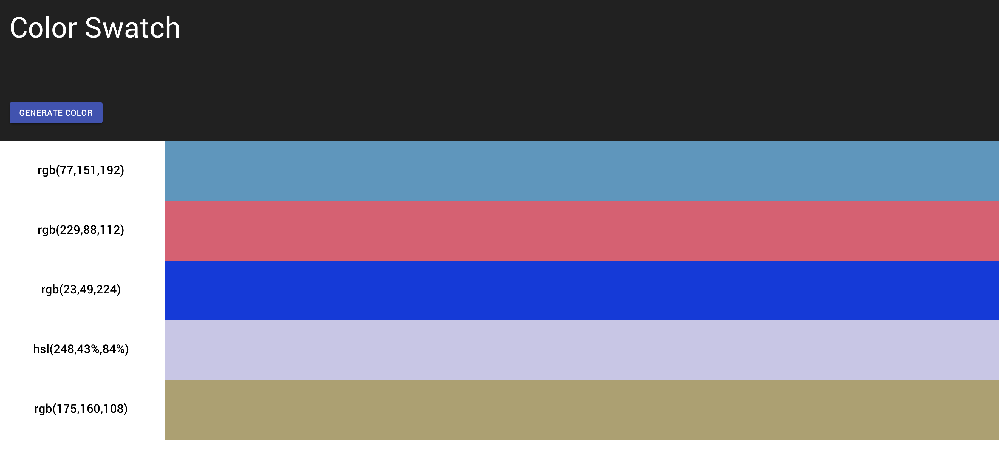

# Colors Challenge

## How to Install and Run

1. `yarn install`
2. `yarn start`

```
Note: Please make sure the backend is running at http://localhost:5000. otherwise please modify the `apiBaseUrl` variable in the src/config.ts
```

## Screenshots


